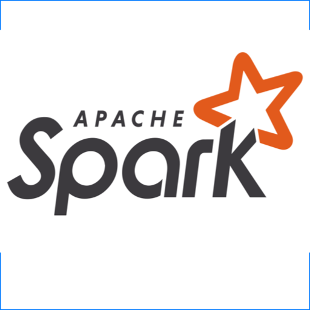

### Hi there ✈️

- 💬 My name is Collin Guidry.
- 🔬 I'm a Data Science and Engineering professional who builds solutions with real-world data.
- 🛫 My current job is to improve airline operational intelligence by analyzing flight crew performance.
- ⚡ I've worked on ML engineering projects for transportation & logistics that generate real-time predictions for and scale to millions of users per day, using large deep learning models.
- 🔮 As a consultant, I've been exposed to a variety of machine learning use cases and techniques.
- 🔭 I'm interested in:
  - Enabling large language models & agents to build data pipelines, analyses, and apps.
  - Streamlining the data science project lifecycle, and building end-to-end projects that are easy to maintain.
  - Simplifying development of near-real-time analytics.
  - Open source data processing and storage frameworks.

### Connect with me:

[][linkedin]
[][twitter]
[][mail]

 

### Languages and Tools:

[][website]
[][website]
[][website]
[][website]
[][website]
[][website]
[][website]
[][website]
[][website]
[][website]
[][website]
[][website]

 

[twitter]: https://twitter.com/collinguidry
[mail]: mailto:c.guidry97@gmail.com
[linkedin]: https://www.linkedin.com/in/collinguidry/
[website]: http://www.github.com/jcguidry
